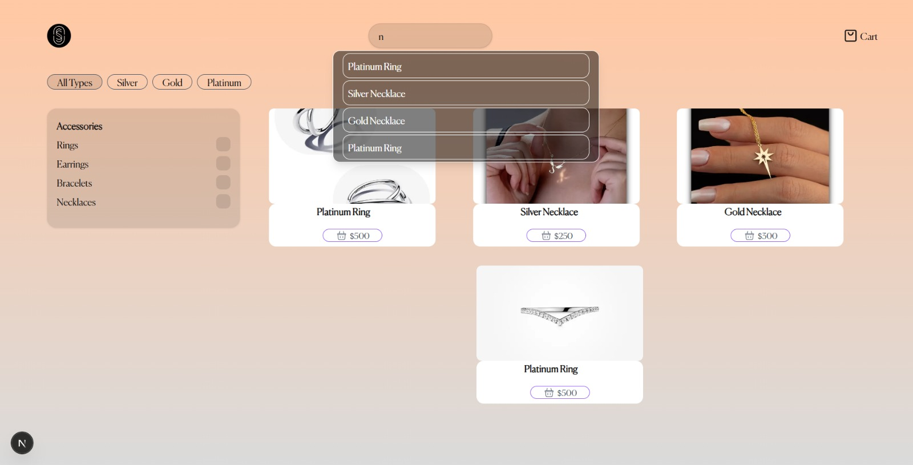
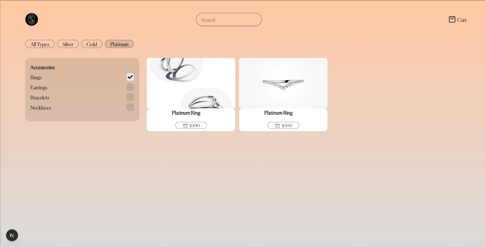
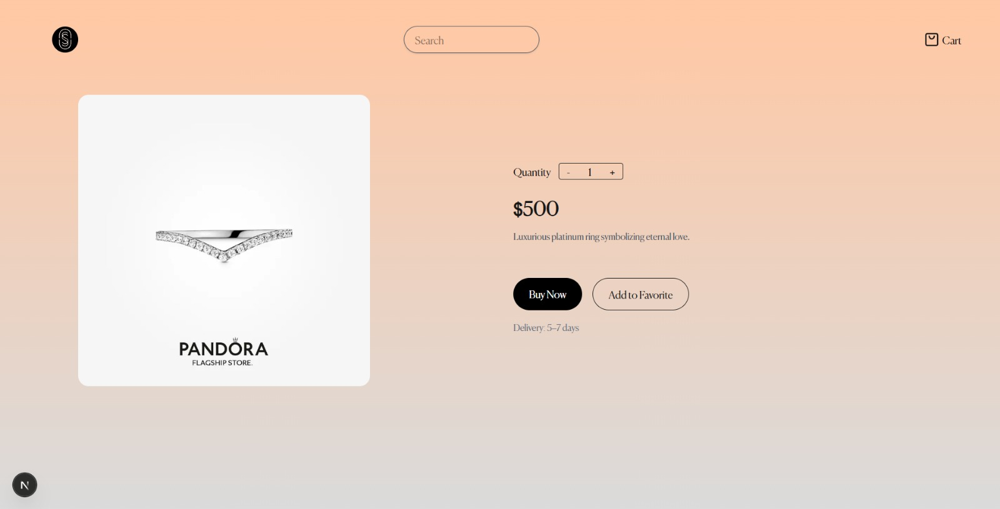
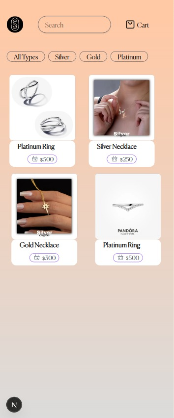
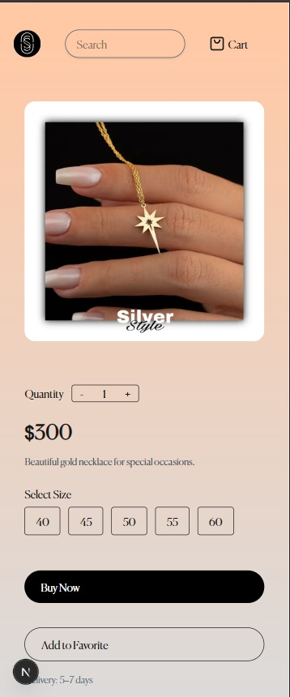

# 🛒 SilverStyle – Full-Stack E-commerce Application

## 📌 Project Overview

SilverStyle is a full-stack e-commerce web application built using **Next.js (Frontend)** and **Node.js + Express (Backend)** with **MongoDB** as the database.

The application allows users to browse products, add items to cart, and manage their shopping cart.

The project follows clean architecture principles and demonstrates real-world full-stack development practices.

---

## ✨ Features

### 🛍 Product Management
- Fetch products from MongoDB
- Product details page
- RESTful API structure

### 🛒 Cart System
- Add to cart
- Remove from cart
- Update product quantity
- Global state management using Redux Toolkit

### 📱 UI/UX
- Fully responsive design
- Clean and modern layout
- Built with Tailwind CSS

---

## 🛠 Tech Stack

### Frontend
- Next.js
- TypeScript
- Redux Toolkit
- Tailwind CSS

### Backend
- Node.js
- Express.js
- MongoDB
- Mongoose

---

## 🏗 Architecture

Client (Next.js) → REST API (Express) → MongoDB Database

- Frontend communicates with backend via REST APIs
- Backend handles database operations

---
## 📸 Screenshots

### 🏠 Home Page

### 🛍 Product Page

